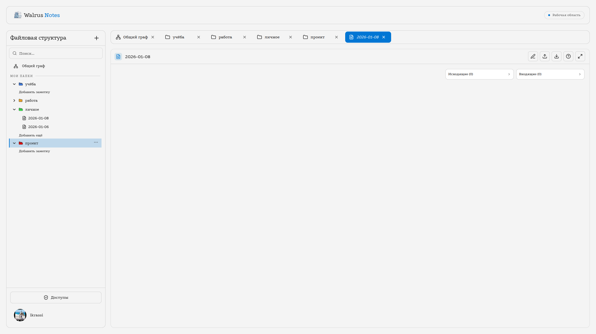
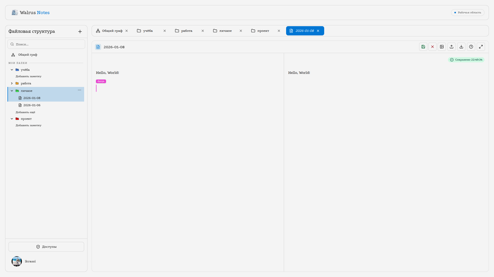
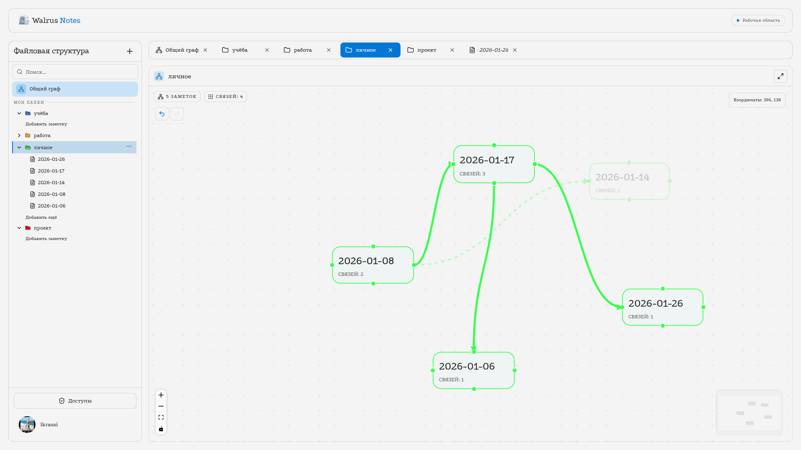
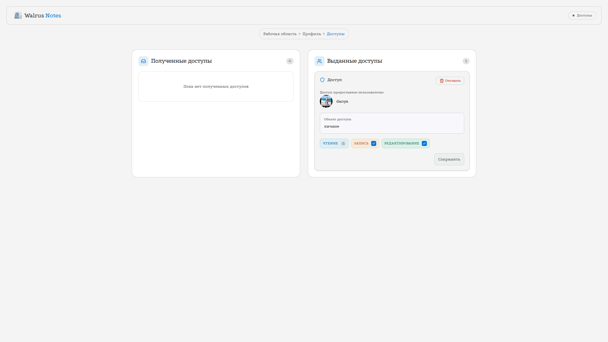
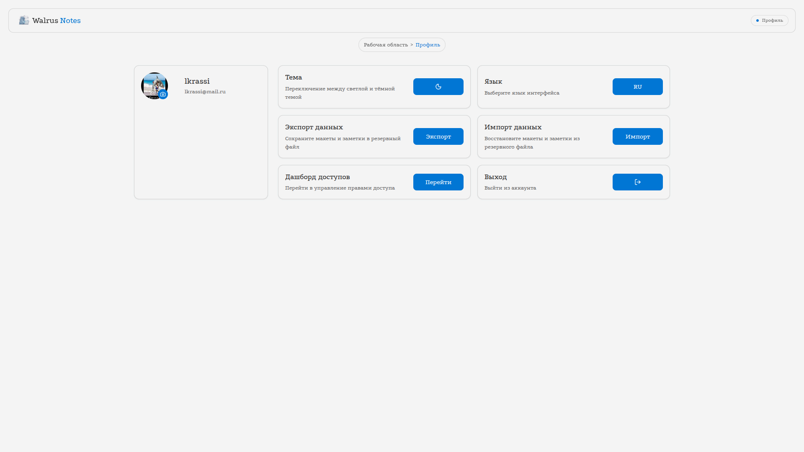
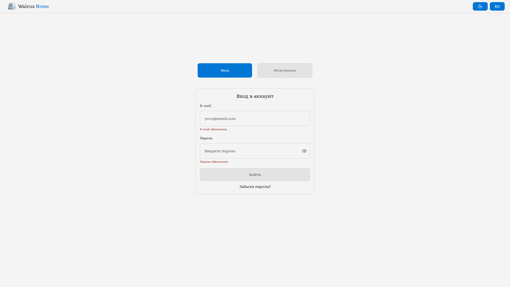

# Walrus Notes

Walrus Notes - это клиентская часть веб-приложения для совместной работы с заметками, их связями и правами доступа.

Проект сделан на React + TypeScript и рассчитан на сценарий, в котором пользователь не просто пишет текст, а собирает из заметок структурированную рабочую среду: редактирует markdown, связывает заметки графом, делится доступом с другими людьми и работает в реальном времени вместе с командой.

Если коротко, это не обычный todo/notepad, а полноценный collaborative knowledge workspace.

## Что это за проект

Walrus Notes решает задачу ведения и совместного редактирования заметок в связанной структуре:

- заметки живут внутри layout-структуры;
- заметки можно открывать, редактировать и просматривать в markdown;
- между заметками можно строить графовые связи;
- доступ к layout можно выдавать другим пользователям;
- один и тот же документ могут одновременно редактировать несколько человек;
- интерфейс поддерживает светлую и тёмную тему, а также русский и английский языки.

## Основные возможности

- Авторизация и регистрация.
- Публичная стартовая страница.
- Основная рабочая зона с layout-структурой и списком заметок.
- Markdown-редактор с preview-режимом.
- Совместное редактирование заметок несколькими пользователями.
- Отображение онлайн-участников и awareness-состояния.
- Статус синхронизации черновика и сохранения.
- Граф заметок и связей между ними.
- Управление связями и расположением узлов.
- Шаринг layout и управление доступами.
- Dashboard с правами доступа.
- Профиль, настройки темы и языка.
- Уведомления, состояния загрузки и skeleton-экраны.

## Главные пользовательские сценарии

### 1. Работа с заметками

Пользователь открывает layout, выбирает заметку, редактирует markdown-контент и видит результат в preview. Это основной сценарий приложения.

### 2. Совместное редактирование

Один и тот же note может быть открыт у нескольких пользователей одновременно. Изменения синхронизируются в реальном времени, а интерфейс показывает состояние подключения и список активных участников.

### 3. Работа с графом

Заметки можно визуализировать как граф. Это помогает видеть связи между сущностями, а не просто хранить их как линейный список.

### 4. Управление доступом

Пользователь может делиться layout с другими людьми и управлять правами: читать, редактировать содержимое и работать со структурой.

### 5. Просмотр и настройка профиля

В профиле доступны настройки внешнего вида, языка, а также связанные пользовательские действия.

## Технологии клиентской части

### Базовый стек

- React 19
- TypeScript
- Vite 7
- React Router 7
- Redux Toolkit
- RTK Query

### UI и взаимодействие

- Tailwind CSS v4
- Framer Motion
- DnD Kit
- Headless UI
- lucide-react

### Работа с данными и формами

- react-redux
- react-i18next + i18next-browser-languagedetector
- Formik
- Yup
- react-markdown + remark-gfm
- Prism.js / prism-react-renderer

### Реальное время и collaboration

- yjs
- y-websocket
- react-use-websocket

### Дополнительно

- tailwind-merge
- clsx
- reactflow
- react-colorful

## Архитектура

Проект построен по Feature-Sliced Design.

Основные слои:

- `app` - инициализация приложения, провайдеры, маршруты, store.
- `pages` - страницы и их композиция.
- `widgets` - крупные блоки интерфейса.
- `features` - пользовательские сценарии.
- `entities` - бизнес-сущности и API.
- `shared` - переиспользуемая инфраструктура, хуки, утилиты и UI.

Такой подход помогает держать код в порядке даже тогда, когда приложение растёт и в нём появляется много независимых сценариев: редактор, граф, права доступа, авторизация, профиль, уведомления, realtime-синхронизация.

Дополнительное описание соглашений по структуре находится в [fsd.md](./fsd.md).

## Основные разделы интерфейса

### Стартовая страница

Публичный экран для первого входа в приложение.

### Авторизация

Отдельный маршрут для входа и регистрации.

### Основная рабочая область

Главный экран приложения, где пользователь работает с папками, заметками, графом и редактором.

### Dashboard

Раздел для управления доступами и shared layout.

### Profile

Страница настроек профиля, темы и языка.

### Unavailable page

Fallback-экран на случай недоступности части приложения.

## Как устроен редактор заметки

Редактор заметки объединяет несколько режимов:

- просмотр markdown;
- редактирование текста;
- real-time collaboration;
- отображение статуса синхронизации;
- управление курсорами и активными пользователями.

Это одна из самых интересных частей проекта, потому что здесь одновременно работают:

- локальное состояние;
- серверная синхронизация;
- WebSocket-события;
- Yjs-коллаборация;
- пользовательский UX для сохранения и восстановления контента.

## Граф и связи между заметками

Отдельная часть приложения посвящена визуализации заметок как графа. Это позволяет:

- видеть структуру знаний целиком;
- перемещать и связывать заметки между собой;
- работать с layout как с интерактивной схемой;
- быстрее ориентироваться в большом количестве контента.

## Управление доступом

В проекте есть отдельный раздел для прав доступа. Он нужен для сценариев, когда пользователь делится layout с другими людьми и управляет уровнем их доступа.

Поддерживаются сценарии вроде:

- просмотр;
- редактирование содержимого;
- редактирование структуры/связей.

## Внешний вид и UX

В интерфейсе используются:

- светлая и тёмная темы;
- адаптивная верстка;
- animated transitions;
- skeleton-загрузки;
- уведомления об ошибках и состояниях;
- удобная боковая навигация;
- вкладки с drag-and-drop.

## Скриншоты интерфейса

### 1. Главный экран приложения

```md

```

### 2. Режим совместного редактирования

```md

```

### 3. Граф заметок

```md

```

### 4. Dashboard с правами доступа

```md

```

### 5. Профиль и настройки

```md

```

### 6. Авторизация

```md

```

## Требования к окружению

- Node.js 20+ рекомендуется.
- pnpm.
- Для полноценной проверки нужен отдельный backend-сервер.

## Запуск проекта

### Установка зависимостей

```bash
pnpm install
```

### Переменные окружения

Создайте `.env` и задайте адрес backend-сервера:

```env
VITE_BASE_URL=example.com
```

### Запуск в режиме разработки

```bash
pnpm dev
```

По умолчанию клиент доступен на `http://localhost:5173`.

## Скрипты

- `pnpm dev` - запуск клиента в режиме разработки.
- `pnpm preview` - локальный предпросмотр production-сборки.
- `pnpm build` - сборка клиента и production-сервера.
- `pnpm start` - запуск собранного сервера из `dist-server`.
- `pnpm start:dev` - запуск server-side части в watch-режиме.
- `pnpm lint` - проверка кода ESLint.
- `pnpm lint:fix` - автоисправление ESLint.
- `pnpm type-check` - проверка TypeScript.
- `pnpm format` - форматирование кода.
- `pnpm format:check` - проверка форматирования.
- `pnpm lint:styles` - проверка CSS через Stylelint.
- `pnpm guardrails` - CSS-проверки и контроль raw-цветов.

## Backend

Клиентская часть работает вместе с отдельным backend-проектом. Для полноценной проверки нужен сервер.

Репозиторий backend:

`https://github.com/SanyaWarvar/walrus_notes`

Спасибо что долистали до конца :D